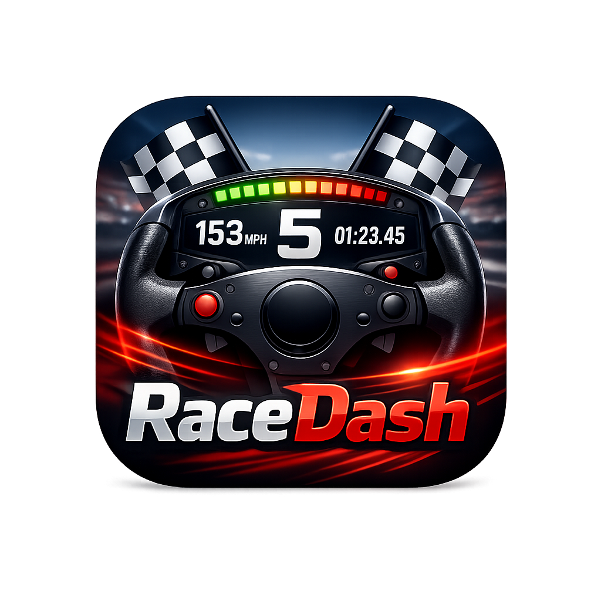

# RaceDash

RaceDash is a mobile racing telemetry dashboard for drivers who want clearer
live data, lap context, and post-session history while racing.

The current release focuses on Gran Turismo 7 telemetry from a PlayStation on
the same network.

## What It Does

- Shows a live racing dash with speed, gear, RPM, throttle, brake, fuel, lap
  timing, sector timing, tyre temperature, and car/track identity when data is
  available.
- Tracks best laps and sector references for selected tracks.
- Displays live sector and lap deltas against saved references.
- Estimates fuel use and laps remaining when the race provides usable fuel data.
- Keeps history for completed laps and race sessions.
- Accumulates lifetime statistics, including raced time, laps, sectors,
  distance, sessions, best laps, and max speed.
- Lets you manually select the active track when the game does not provide a
  reliable live track identifier.

## Supported Game

Gran Turismo 7 is the first supported game.

RaceDash is independent software. It is not affiliated with, endorsed by, or
sponsored by Sony Interactive Entertainment, Polyphony Digital, PlayStation, or
any vehicle manufacturer.

## Installation

Download the APK from the GitHub release and install it on an Android device.

Android may ask you to allow installing apps from your browser or file manager.
Only install APKs downloaded from the official RaceDash release page.

## Basic Setup

1. Connect your Android device and PlayStation to the same local network.
2. Open RaceDash.
3. Select Gran Turismo 7.
4. Open the game configuration screen.
5. Enter the PlayStation IP address and save it.
6. Start driving in GT7 and open the Dash or Live view.

Telemetry availability depends on the game state, network conditions, and the
data exposed by GT7.

## Data and Privacy

RaceDash is designed for local telemetry use. Session history, best laps,
statistics, selected tracks, and app settings are stored on the device.

Do not share exported app data publicly if you consider your lap history,
network settings, or racing profile private.

## Support

If RaceDash helped you, you can support the project with a donation:
[paypal.me/lmirel](https://paypal.me/lmirel)

## License

RaceDash is distributed as a release binary. Project-specific material is
licensed under the terms included with this project. Third-party packages,
assets, fonts, game names, car names, track names, and trademarks remain subject
to their respective owners' terms.
